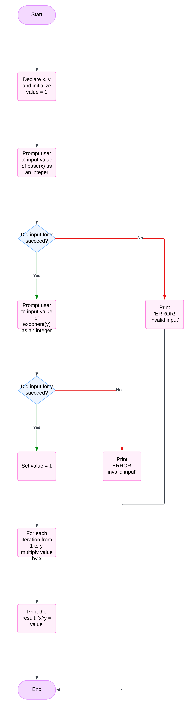

# System design for power problem

## input
1. **base(x) value as an int data type**
2. **exponent(y) value as an int data type**
   
## output
1. **x^y or base the power of exponent**

## operation
1. **iteration**: use a `for` loop to multiply x by itself y times.
2. **multiplication**: 

## Pseudo code
1. start.
2. declare x, y and declare and initialise value = 1.
3. prompt the user to input value of base(x) as an int.
4. if the input fails, print "ERROR! invalid input".
5. prompt the user to input value of exponent(y) as an int.
6. if the input fails, print "ERROR! invalid input".
7. Use a loop to calculate `x^y`:
   7.1 Set `value = 1`.
   7.2 For each iteration from 1 to `y`, multiply `value` by `x`.
8. Print the result: "x^y = value".
9. End the program.

## Flow chart

