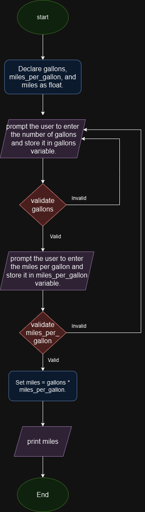

# Algorithm design
## Input

-maximum number of gallons the car is capable of holding

-how many miles the car can travel with each gallon.

-validates input so that the inputs entered are greater or equal to 0.
## Calculation

Calculate the maximum amount of miles the car can travel without refueling by multiplying the two inputs.
## Output

-display the calculated miles.
# Pseudo code
1. Declare variables gallons, miles_per_gallon, and miles as float.  

2. Prompt user to enter the number of gallons.  

3. Read input and store it in gallons.  

4. Prompt user to enter the miles per gallon.  

5. Read input and store it in miles_per_gallon.  

6. Set miles = gallons * miles_per_gallon.  

7. Print "Your car can travel miles miles without refueling."

# Flow chart

