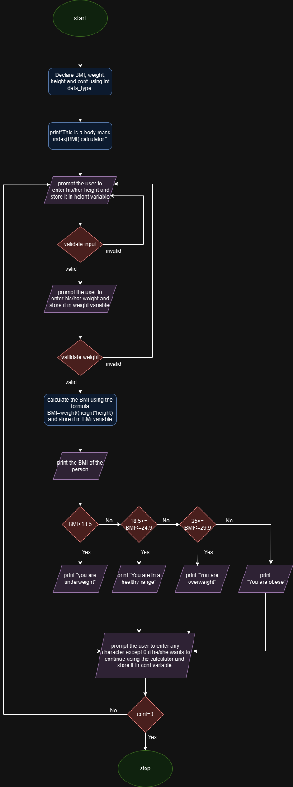

# BMI Calculator System Design

## Input 
- Accepts user input for height and weight.
- Validates inputs to ensure they are positive numbers.

## BMI Calculation
- Computes BMI using the formula: 
  [
  BMI=weight/(height*height)]

## Output
- Displays the calculated BMI.
- Provides feedback on weight category based on BMI value.

## Loop 
- Offers the user an option to continue or terminate the program after each calculation.

## User Interface
- Console-based interaction with prompts and outputs printed in the terminal.

# BMI Calculator Pseudocode

## Step 1: Start the program

## Step 2: Declare variables
- BMI, weight, height, cont as float

## Step 3: Print
- "This is a Body Mass Index (BMI) calculator"

## Step 4: Enter an infinite loop (while true)

### Step 5: Print
- "Please enter your height in meter:"

### Step 6: Read input into height

### Step 7: If input fails OR height <= 0 THEN
- **Step 8:** Print "Invalid input!"
- **Step 9:** Clear input stream
- **Step 10:** Ignore invalid input
- **Step 11:** Continue to next iteration of the loop(go to step 5) 

### Step 12: Print
- "Please enter your weight in kilograms:"

### Step 13: Read input into weight

### Step 14: If input fails OR weight <= 0 THEN
- **Step 15:** Print "Invalid input!"
- **Step 16:** Clear input stream
- **Step 17:** Ignore invalid input
- **Step 18:** Continue to next iteration of the loop(go to step 5)

### Step 19: Calculate 
- BMI = weight / (height * height)

### Step 20: Print
- "Your BMI is " + BMI + "."

### Step 21: If BMI < 18.5 THEN
- **Step 22:** Print "You are underweight!"

### Step 23: Else if BMI >= 18.5 AND BMI <= 24.9 THEN
- **Step 24:** Print "You are in a healthy weight range!"

### Step 25: Else if BMI >= 25 AND BMI <= 29.9 THEN
- **Step 26:** Print "You are in overweight range!"

### Step 27: Else
- **Step 28:** Print "You are in obesity state!"

### Step 29: Print
- "If you want to terminate the calculator enter 0 and if you want to continue enter any other digit except 0."

### Step 30: Read input into cont

### Step 31: If input fails THEN
- **Step 32:** Clear input stream
- **Step 33:** Ignore invalid input
- **Step 34:** Continue to next iteration of the loop(go to step 5)

### Step 35: Else if cont == 0 THEN
- **Step 36:** Print "Thank you for using my BMI calculator."
- **Step 37:** Break from the loop

## Step 38: End the program
# Flow chart

