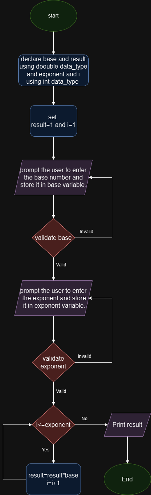

# Power Problem System Design

## Input 
- Accepts user input for base and exponent.
- Validates inputs to ensure that they are numbers.
-Handles invalid input gracefully and allows the user to re-enter.
## Power Calculation
- Uses iterative multiplication to calculate the power based on the sign of the exponent.
## Output
- Displays the calculated power value.

## Pseudo Code

**Step 1:** Start the program.

**Step 2:** Initialize result to 1.

**Step 3:** Get base input from the user.

**Step 4:** Get exponent input from the user.

**Step 5:** Check if exponent is less than 0:
- If true:
  - **Step 5.1:** For i from 1 to -exponent:
    - **Step 5.1.1:** Multiply result by base.
  - **Step 5.2:** Set result to 1 / result.

**Step 6:** Else (if exponent is greater than or equal to 0):
- **Step 6.1:** For i from 1 to exponent:
  - **Step 6.1.1:** Multiply result by base.

**Step 7:** Print "base raised to the power of exponent is result."

**Step 8:** End the program.

#Flow chart

