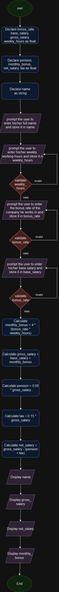

# Algorithm design
## Input

- The user's full name
- The user's base salary
- The user's weekly working hours
- The bonus rate of the company that the user works in.

## Calculation

- calculate the monthly bonus as 4*(bonus rate * weekly working hours)
- calculate the gross salary as gross salary= base salary + monthly bonus
- calculate the pension as 0.05 * gross salary
- calculate the tax as 0.15 * gross salary
- calculate the net salary as net salary = gross salary-(pension + tax)

## output
- display the full name of the person.
- display the calculated gross salary, net salary and monthly bonus.

# Pseudo code
## start the program
1. Declare bonus_rate, base_salary, gross_salary, weekly_hours, pension, monthly_bonus, net_salary, tax as float
2. Declare name as string
3. Prompt user to enter their full name
4. Read input and store it in name
5. Prompt user to enter their base salary
6. Read input and store it in base_salary
7. Prompt user to enter their weekly working hours
8. Read input and store it in weekly_hours
9. Prompt user to enter the company's bonus rate per hour
10. Read input and store it in bonus_rate
11. Calculate monthly_bonus = 4 * (bonus_rate * weekly_hours)
12. Calculate gross_salary = base_salary + monthly_bonus
13. Calculate pension = 0.05 * gross_salary
14. Calculate tax = 0.15 * gross_salary
15. Calculate net_salary = gross_salary - (pension + tax)
16. Display name
17. Display gross salary 
18. Display net_salary
19. Display monthly_bonus

## End the program
# Flow chart

