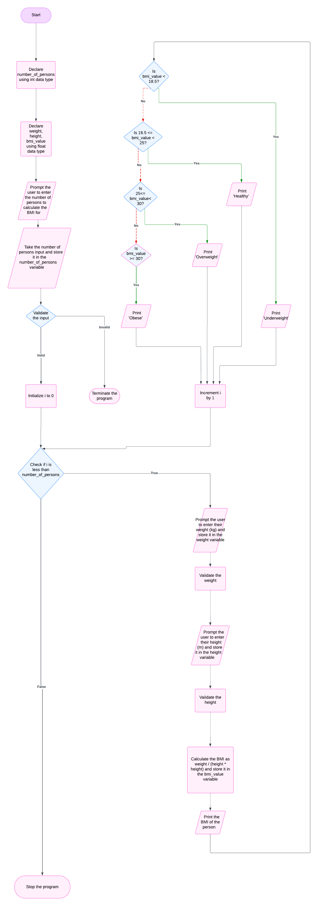

# System Design for BMI Calculator

## Input
1. **Number of Persons**: Integer data type
2. **Weight**: Float data type
3. **Height**: Float data type

## Output
1. **BMI of a Person**
2. **Health Status of a Person**

## Operation
1. **Iteration**: Use a `for` loop to process each person.
2. **Selection Statement**: Use multi-conditional statements to determine the health status of each person based on their BMI.

## Pseudo Code
1. Start the program.
2. Declare `number_of_persons` using `int` data type.
3. Declare `weight`, `height`, `bmi_value` using `float` data type.
4. Prompt the user to enter the number of persons to calculate the BMI for.
5. Take the number of persons input and store it in the `number_of_persons` variable.
6. Validate the input; if it is invalid, terminate the program, otherwise proceed to step 7.
7. Initialize `i` to 0.
8. Check if `i` is less than `number_of_persons`; if true, proceed to step 8.1, otherwise go to step 9.
    8.1. Prompt the user to enter their weight (kg) and store it in the `weight` variable.
    8.2. Validate the weight.
    8.3. Prompt the user to enter their height (m) and store it in the `height` variable.
    8.4. Validate the height.
    8.5. Calculate the BMI as `weight / (height * height)` and store it in the `bmi_value` variable.
    8.6. Print the BMI of the person.
    8.7. If `bmi_value` is less than 18.5, print "Underweight", otherwise go to step 8.8.
    8.8. If `18.5 <= bmi_value < 25`, print "Healthy", otherwise go to step 8.9.
    8.9. If `25 <= bmi_value < 30`, print "Overweight", otherwise go to step 8.10.
    8.10. If `bmi_value >= 30`, print "Obese".
    8.11. Increment `i` by 1.
    8.12. Go to step 8.
9. Stop the program.

## Flow chart
