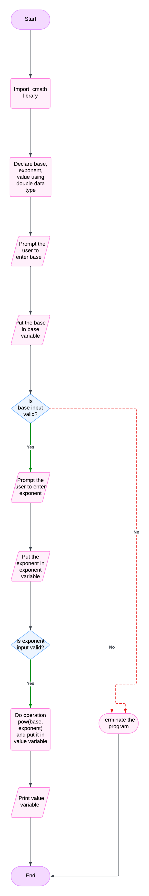

# System Design for Power

## Input
1. **Base**: double data type
2. **Exponent**: double data type

## Output
1. **Base the power of Exponent**

## Operation
1. **Power function**: base the power of exponent

## Pseudo Code
1. Start the program.
2. Import `<cmath>` library.
3. Declare `base`, `exponent`, `value` using `double` data type.
4. Prompt the user to enter `base`.
5. Put the `base` in `base` variable.
6. Validate the input; if it is invalid, terminate the program, otherwise proceed to step 7.
7. Prompt the user to enter `exponent`.
8. Put the `exponent` in `exponent` variable.
9. Validate the input; if it is invalid, terminate the program, otherwise proceed to step 10.
10. Do operation `pow(base, exponent)` and put it in `value` variable.
11. Print `value` variable.
12. Stop the program.

## Flow chart
