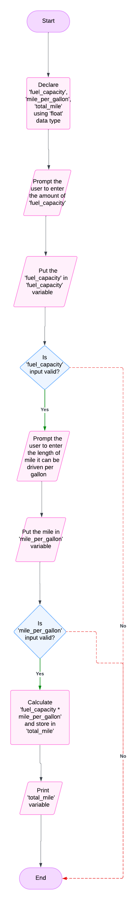

# System Design for total number of miles

## Input
1. **Fuel capacity**: float data type
2. **mile per gallon**: Float data type

## Output
1. **Total mile**

## Operation
1. **Multiplication**: multipliying fuel capacity * mile per gallon

## Pseudo Code
1. Start the program.
2. Declare `fuel_capacity`, `mile_per_gallon`, `total_mile` using `float` data type.
3. Prompt the user to enter the amount of `fuel_capacity`.
4. Put the `fuel_capacity` in `fuel_capacity` variable.
5. Validate the input; if it is invalid, terminate the program, otherwise proceed to step 6.
6. Prompt the user to enter the length of mile it can be driven per gallon.
7. Put the mile in `mile_per_gallon` variable.
8. Validate the input; if it is invalid, terminate the program, otherwise proceed to step 9.
9. Do operation `fuel_capacity * mile_per_gallon` and put it in `total_mile` variable.
10. Print `total_mile` variable.
11. Stop the program.

## Flow chart
