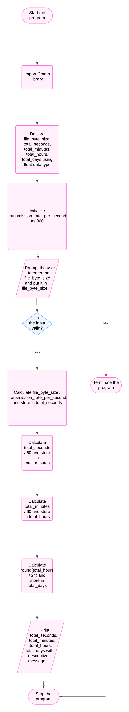

# System Design for tranmission

## Input
1. **file_byte_size: Double data type**

## Output
1. **Total seconds**
2. **Total minutes**
3. **Total hours**
4. **Total days**

## Operation
1. **Multiplication**:  
    transmission_rate_per_second = 960;
    total_seconds = file_byte_size / transmission_rate_per_second;
    total_minutes = total_seconds / 60;
    total_hours = total_minutes / 60;
    total_days = round(total_hours / 24);
2. **Intialize trasmission_rate_per_second as 960**

## Pseudo Code
1. Start the program.
2. Import Cmath library.
3. Declare `file_byte_size`, `total_seconds`, `total_minutes`, `total_hours`, `total_days` using `float` data type.
4. Initialize `transmission_rate_per_second` as 960.
5. Prompt the user to enter the `file_byte_size` and put it in `file_byte_size`.
6. Validate the input; if it is invalid, terminate the program, otherwise proceed to step 7.
7. Do operation `file_byte_size / transmission_rate_per_second` and put it in `total_seconds`.
8. Do operation `total_seconds / 60` and put it in `total_minutes`.
9. Do operation `total_minutes / 60` and put it in `total_hours`.
10. Do operation `round(total_hours / 24)` and put it in `total_days`.
11. Print `total_seconds`, `total_minutes`, `total_hours`, `total_days` with descriptive message.
12. Stop the program.

## Flow chart
