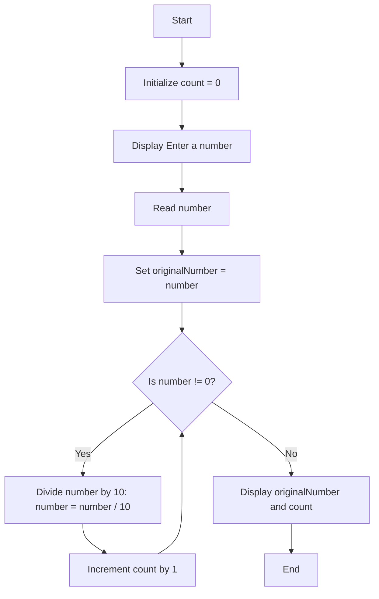

## **QUESTION**:-
write a program that counts the number of digits in a given number (e.g. 23,498 has five digits)
## **PROBLEM ANALYSIS**:-
#### **Input**:- 
1. Integer
#### **Output**:-
1. Number of digits of the number
#### **Operation**:-
1.  Divide the number by 10 repeatedly until it becomes 0, incrementing a counter each time.
## **PSEUDOCODE**
1. start the program
2. read an integer
3.  Divide the number by 10 repeatedly until it becomes 0, incrementing a counter each time.
4.  stop the program
## **FLOWCHART**

