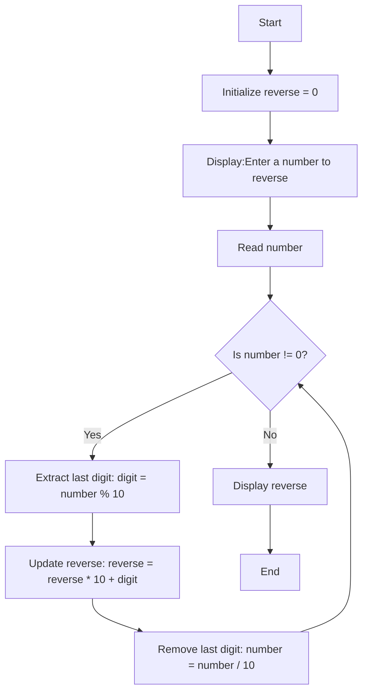

## **QUESTION**
Write a program that Prints the reverses of the number (e.g. input = 4637215 Output=5217364).
## **PROBLEM ANALYSIS**
#### **Input**:-
1. An integer
#### **Output**:-
1. Reverse of that integer
#### **Operation**:-
1.  while the number is not 0: 
    1.1.Extract the last digit of number using number % 10. 
    1.2.Add this digit to reverse after multiplying reverse by 10 to shift its digits. 
    1.3. Remove the last digit from number using integer division (number / 10). 
    1.4. Output reverse, which now holds the reversed digits. 
## **PSEUDOCODE**
1. Start the program
2. Read a number
3. While the number is not 0: 
    3.1.Extract the last digit of number using number % 10. 
    3.2.Add this digit to reverse after multiplying reverse by 10 to shift its digits. 
    3.3. Remove the last digit from number using integer division (number / 10). 
    3.4. Output reverse, which now holds the reversed digits.
4. Stop the program
## **FLOWCHART**

